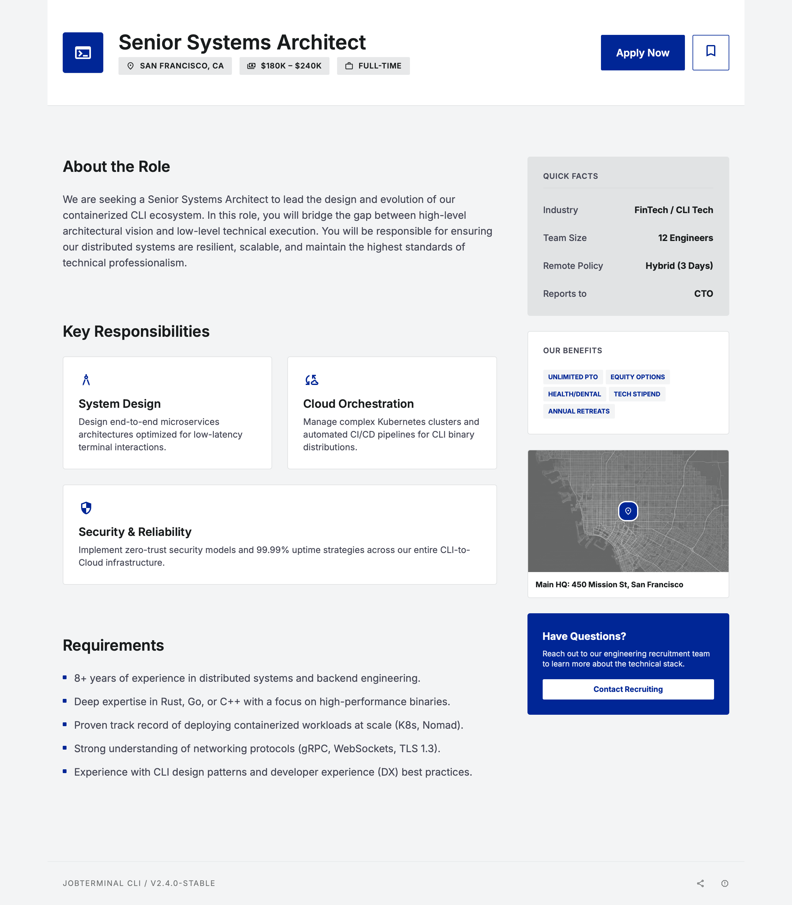

# Neksus JobSpec

[](https://github.com/NeksusAI/NeksusJobSpec/actions/workflows/ci.yml)
[](https://docs.jobspec.neksusai.com/)
[](https://pypi.org/project/neksus-jobspec/)
[](https://pypi.org/project/neksus-jobspec/)

Neksus JobSpec is an open, local-first CLI and Python package for structured, branded, machine-readable job campaigns.

This package does not collect applications, upload CVs, send emails, take payments, or manage candidates.

## Status

Current focus is a stable CLI and reusable core library with deterministic exports, feeds, and sitemap generation.

## Job page composition

v0.3.x uses controlled, Lego-brick-like job-detail page components.
You can compose validated page blocks such as header_brand, hero_banner, hero, meta_panel, CTA, responsibilities, requirements, benefits, quote, social_links, location_map, company profile, and legal blocks without defaulting to arbitrary HTML.

`soft-professional` is rendered from YAML components plus the built-in theme.

- Example: [`examples/job-detail.jobspec.yaml`](examples/job-detail.jobspec.yaml)
- Docs: [`docs/concepts/specification.md`](docs/concepts/specification.md), [`docs/concepts/rendering.md`](docs/concepts/rendering.md), [`docs/concepts/themes.md`](docs/concepts/themes.md), [`docs/guides/examples.md`](docs/guides/examples.md)
- Deep dives: [`docs/guides/soft-professional-guide.md`](docs/guides/soft-professional-guide.md), [`docs/guides/content-vs-theme.md`](docs/guides/content-vs-theme.md), [`docs/guides/render-troubleshooting.md`](docs/guides/render-troubleshooting.md)

Rendered example screenshot:



For portable web output paths, use `rendering.web.asset_base_url` in spec files or `--asset-base-url` in CLI rendering commands.

## Installation

```bash
pip install neksus-jobspec
```

Local MCP server (optional extra):

```bash
pip install "neksus-jobspec[mcp]"
neksus-jobspec-mcp
```

## Quickstart

```bash
pip install neksus-jobspec
mkdir neksus-jobspec-demo
cd neksus-jobspec-demo
neksus-jobspec init
neksus-jobspec spec new backend-engineer
neksus-jobspec spec validate jobspecs/backend-engineer.jobspec.yaml
neksus-jobspec spec render jobspecs/backend-engineer.jobspec.yaml --format web --output dist/backend-engineer.html
neksus-jobspec spec export jobspecs/backend-engineer.jobspec.yaml --target generic-json --out dist/backend-engineer.json
neksus-jobspec spec export jobspecs/backend-engineer.jobspec.yaml --target generic-xml --out dist/backend-engineer.xml
neksus-jobspec spec export jobspecs/backend-engineer.jobspec.yaml --target linkedin-ready-json --out dist/backend-engineer-linkedin.json
neksus-jobspec feed export "examples/*.jobspec.yaml" --target jobs-json --out dist/jobs.json
neksus-jobspec feed sitemap "examples/*.jobspec.yaml" --base-url https://company.dk/jobs --out dist/sitemap.xml
```

## Python API

```python
from neksus_jobspec import JobSpec, load_jobspec, render_jobspec, validate_jobspec

spec = load_jobspec("jobspecs/backend-engineer.jobspec.yaml")
validated = validate_jobspec(spec.model_dump())
web = render_jobspec(validated, format="web")
print(web[:80])
```

## Basic CLI usage

```bash
neksus-jobspec init
neksus-jobspec spec new backend-engineer
neksus-jobspec spec validate jobspecs/backend-engineer.jobspec.yaml
neksus-jobspec spec render jobspecs/backend-engineer.jobspec.yaml --format web
neksus-jobspec spec export jobspecs/backend-engineer.jobspec.yaml --target generic-json --out dist/backend-engineer.json
neksus-jobspec feed export "examples/*.jobspec.yaml" --target jobs-json --out dist/jobs.json
neksus-jobspec feed sitemap "examples/*.jobspec.yaml" --base-url https://company.dk/jobs --out dist/sitemap.xml
neksus-jobspec themes
neksus-jobspec themes show soft-professional
```

## Development

```bash
uv sync
uv run ruff check .
uv run ruff format --check .
uv run pytest
uv run pytest -m integration && uv run python -m mkdocs build --strict
```

## Development build commands

```bash
python -m pip install --upgrade build twine
python -m build
python -m twine check dist/*
python -m pip install --force-reinstall dist/neksus_jobspec-*.whl
python -c "import neksus_jobspec; print(neksus_jobspec.__version__)"
```

## Release process

Create and push a semantic version tag to trigger publishing:

```bash
git tag v0.3.0
git push origin v0.3.0
```

You can also run the publish workflow manually from GitHub Actions (`workflow_dispatch`).

Release notes are maintained in [`docs/project/release-notes.md`](docs/project/release-notes.md), with compatibility expectations defined in [`docs/project/versioning.md`](docs/project/versioning.md).
See full change history in [`CHANGELOG.md`](CHANGELOG.md).
Security reporting and support policy: [`SECURITY.md`](SECURITY.md).

## Documentation and assistant packs

- Docs index: [`docs/`](docs/)
- Export docs: [`docs/exports.md`](docs/exports.md)
- LLM usage: [`docs/llm-usage.md`](docs/llm-usage.md)
- Local MCP server: [`docs/integrations/mcp-server.md`](docs/integrations/mcp-server.md)
- MCP install matrix: [`docs/integrations/mcp-install-matrix.md`](docs/integrations/mcp-install-matrix.md)
- Scope boundaries: [`docs/roadmap-boundaries.md`](docs/roadmap-boundaries.md)
- Optional assistant prompt packs: [`skills/`](skills/)

## PyPI publishing notes

Publishing is configured through GitHub Actions Trusted Publishing (OIDC) in `.github/workflows/publish-pypi.yml`.
No PyPI API token is used by the workflow.

## License

Licensed under AGPL-3.0-or-later. See [LICENSE](LICENSE).

## Contribution policy

This repository is owner-maintained and does not use a public external contribution workflow.

## Testing Strategy

Three required layers:

- Unit/CLI layer: `uv run pytest -m "not integration"`
- Smoke layer: `uv run pytest -m integration && uv run python -m mkdocs build --strict`
- Integration layer: `uv run pytest -m integration`

Recommended local sequence:

```bash
uv run pytest -m "not integration"
uv run pytest -m integration && uv run python -m mkdocs build --strict
uv run pytest -m integration
```
