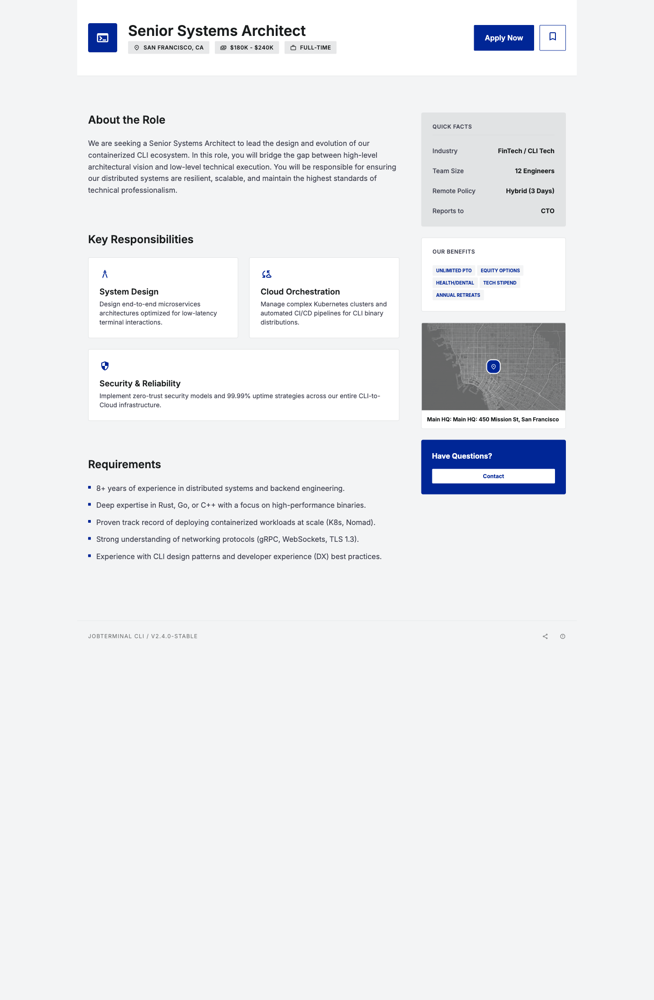

# Themes

Neksus renders `web` output with built-in themes and supports user-defined filesystem theme packages.

## Built-in theme

List available themes:

```bash
neksus-jobspec themes
neksus-jobspec themes --json
```

Inspect theme metadata:

```bash
neksus-jobspec themes show soft-professional
```

Current built-in:

- `classic`
- `classic-dark`
- `custom`
- `soft-professional`

Use it at render time:

```bash
neksus-jobspec spec render examples/job-detail.jobspec.yaml --format web --theme soft-professional --output dist/job-detail.html
```

## Theme guides

- [Soft-Professional Guide](../guides/soft-professional-guide.md)
- [Classic Theme Guide](../guides/classic-guide.md)
- [Classic-Dark Theme Guide](../guides/classic-dark-guide.md)
- [Custom Theme Package Guide](../guides/custom-theme-package.md)

## Theme customization

Web styling is owned by theme packages only. Runtime CSS overrides are not supported.

Use a fully user-defined theme package:

```bash
neksus-jobspec spec render examples/job-detail.jobspec.yaml --format web --theme ./my-theme-package
```

Theme package directory requirements:

- `manifest.json`
- `template.html.j2`
- CSS file(s) declared in `manifest.json`
- Declared components/regions must be existing built-in component/region types.
- Theme manifests must declare support for the global mandatory component set.
- Theme-specific knobs should be defined in `rendering.web.theme_config`.

## Theme selection in JobSpec YAML

```yaml
rendering:
  web:
    template: soft-professional
```

`rendering.web.template` can be one of built-in theme names (`classic`, `classic-dark`, `soft-professional`) or a filesystem path to a custom theme package when `--theme custom` is used.

Built-in theme assets are package-scoped under:

- `src/neksus_jobspec/jobspec/rendering/theme_packages/<theme-name>/manifest.json`
- `src/neksus_jobspec/jobspec/rendering/theme_packages/<theme-name>/template.html.j2`
- CSS files referenced by each theme package manifest.

## Real render examples

### Soft-Professional



### Classic


### Classic-Dark


