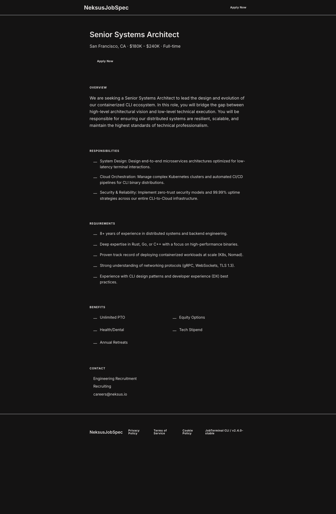

# Classic-Dark Theme Guide

This guide explains how a component-based JobSpec maps to visible output in the built-in `classic-dark` theme.

## Render command

```bash
neksus-jobspec spec render examples/job-detail.jobspec.yaml --format web --theme classic-dark --output dist/job-detail-classic-dark.html
```

## YAML-to-UI mapping

- Uses the same component mapping contract as `classic`
- Applies dark-surface visual contract and dark typography palette
- Top bar, section separators, lists, process flow, contact, and footer are all data-driven from existing components

## Minimal required component set

- `hero`
- `rich_text`
- `feature_grid`
- `list`
- `benefits`
- `application_process`
- `contact`

## Theme screenshot


