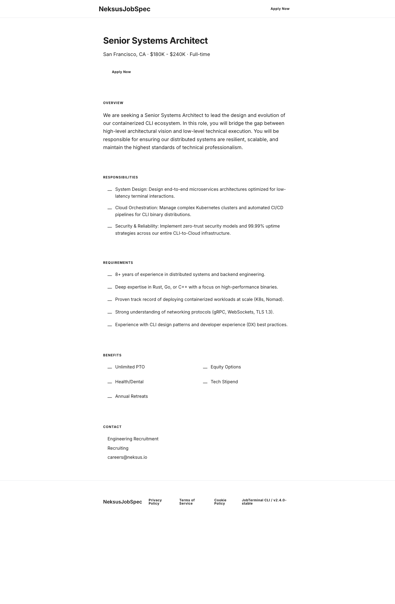

# Classic Theme Guide

This guide explains how a component-based JobSpec maps to visible output in the built-in `classic` theme.

## Render command

```bash
neksus-jobspec spec render examples/job-detail.jobspec.yaml --format web --theme classic --output dist/job-detail-classic.html
```

## YAML-to-UI mapping

- Top bar brand: `header_brand.brand_name` fallback `NeksusJobSpec`
- Top action: `job.apply.label` fallback `Apply Now`
- Hero title: `job.title` or `hero.title`
- Hero subtitle: `job.intro` or `hero.intro`
- Overview section: `rich_text.body`
- Responsibilities list: `feature_grid.items[*]` mapped as `title: body`
- Requirements list: `list.items[*]`
- Benefits 2-column list: `benefits.items[*]`
- Application process: `application_process.steps[*]`
- Contact block: `contact` fields (`name`, `role`, `email`, etc.)
- Footer legal text: `footer_brand.body` fallback theme default

## Minimal required component set

- `hero`
- `rich_text`
- `feature_grid`
- `list`
- `benefits`
- `application_process`
- `contact`

## Theme screenshot


